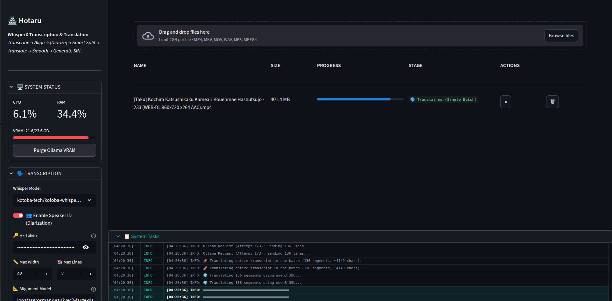

# 🏯 Hotaru (蛍) — Professional Japanese-to-English Anime Subtitling Engine



### 🚀 High-Performance Local AI Pipeline for Precision Subtitling

[](https://www.python.org/)
[](https://ollama.com/)
[](https://github.com/m-bain/whisperX)
[](https://www.nvidia.com/)

**Hotaru** is a high-accuracy, locally-hosted AI subtitling tool designed to transform raw Japanese anime into professional-grade English subs. By bridging the gap between frame-perfect audio alignment (**WhisperX**) and context-aware dialogue translation (**Ollama/Qwen3**), Hotaru delivers "fansub quality" at machine speed without ever leaving your hardware.

---

## 🚀 Why Hotaru?

Stop waiting for fan-subs or settling for literal, "robotic" official translations. Hotaru gives you the power to create beautiful, context-aware subtitles on your own hardware.

*   **🎯 Precision Timing:** Frame-perfect alignment that snaps to speech using word-level phoneme data.
*   **🌎 Cultural Accuracy:** AI personas that understand honorifics, pro-drop subjects, and character "voice."
*   **🔒 Complete Privacy:** No cloud APIs, no data harvesting, no subscription fees.

---

## ✨ Key Features

*   **🎤 Vocal Isolation (Phase 0):** Integrated **Demucs (htdemucs)** to strip BGM and SFX. Feed pristine, voice-only tracks into WhisperX for 100% deterministic VAD and zero hallucinations.
*   **🎯 Word-Level Precision:** Powered by **WhisperX phoneme alignment** for frame-perfect subtitle timing that never drifts.
*   **👥 Speaker-Aware Timing:** Monitors speakers at the **word level**, ensuring Person B's text never "spoils" Person A's dialogue.
*   **🌎 Two-Pass Localization:**
    *   **Pass 1 (Specialist):** Context-aware translation that recovers dropped subjects and preserves honorifics.
    *   **Pass 2 (Director):** Refines punctuation and flow using a **256K context window** to maintain narrative continuity.
*   **🎵 Automated Song Filtering:** Integrated **Heuristic Song Detection** and strict **VAD (0.50 Onset)** to skip musical themes.
*   **💾 Persistent Task Management:** A **uTorrent-inspired dashboard** that persists state to disk. Close your browser, refresh the page, or restart the app—your translation queue and progress stay exactly where you left them.
*   **🛠️ Proxmox-Style Monitoring:** Real-time system telemetry and an independent task tray. Monitor **VRAM fluctuations**, CPU usage, and granular engine logs in a live console.
*   **☢️ Nuclear VRAM Reset:** Advanced memory orchestration between transcription and translation phases.

---

## 🎨 Sleek UI/UX

Hotaru features a professional **Teal-Dark Aesthetic** designed for long-session productivity:
*   **Fixed Sidebar:** Instant access to System Status, Transcription settings, and Ollama configuration.
*   **Adaptive Task Tray:** A docked, collapsible log console that moves with your sidebar.
*   **One-Click Preview:** View and edit your generated SRTs directly in the browser before downloading.
*   **Segmented Updates:** Truly independent UI fragments ensure hardware stats and logs update without flickering the task list.

---

## ⚡ Technical Optimizations

### 🚀 Segmented Architecture
Hotaru is built as a modular package. The UI, Engine, and Common utilities are strictly decoupled to ensure high performance and zero WebSocket noise.

### 🛡️ Resource Guard
Actively monitors host RAM and VRAM availability, triggering aggressive garbage collection to prevent OOM termination.

---

## 🛠️ Installation & Setup

### 1. Prerequisites
*   **Hardware:** NVIDIA GPU (24GB VRAM recommended for 30B+ models).
*   **Backend:** [Ollama](https://ollama.com/) installed and running.
*   **System:** `ffmpeg` installed on your host OS.

### 2. Quick Start
```bash
# Clone the repository
git clone https://github.com/yourusername/hotaru.git
cd hotaru

# Launch the dashboard
pip install -r requirements.txt
streamlit run app.py
```

---

## 🧠 The AI Pipeline
1.  **Isolate:** Vocal Isolation (Demucs) to strip BGM/SFX.
2.  **Transcribe:** Japanese transcription via **WhisperX** with **0.50 VAD Onset**.
3.  **Align:** Phoneme-level refinement using standard or custom **Wav2Vec2** models.
4.  **Resegment:** Speaker-aware **Buffer-and-Flush** splitting based on natural pauses and density.
5.  **Translate:** Localization pass using **Anime Localization Specialist** persona.
6.  **Smooth:** Final refinement pass using **Anime Script Editor and Director** persona with MoE-optimized context linking.

---

## 🔒 Privacy First
No cloud APIs. No data harvesting. **Everything stays on your machine.**

---

*“Subtitling isn't just about translation; it's about preserving the soul of the scene.”* — **Hotaru Team**
